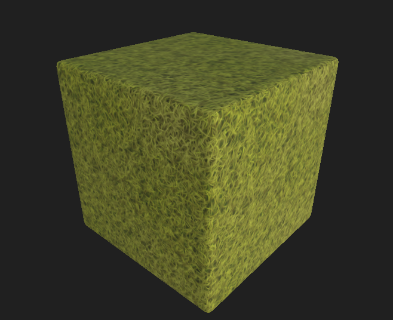
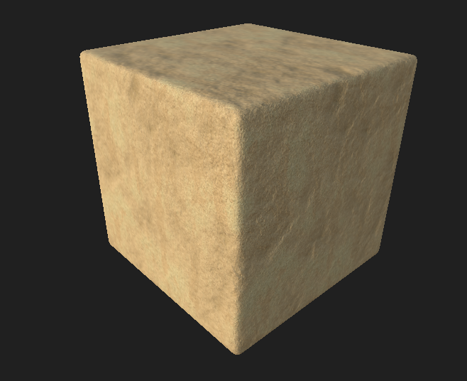
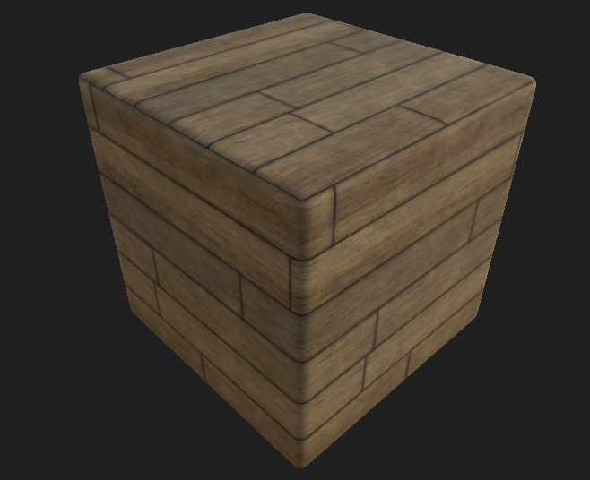

<table>
  <tr>
    <td></td>
    <td></td>
    <td></td>
  </tr>
 </table>

# Amethyst-Asset-Library Pitch

A set of free texture, and model assets for use inside Amethyst!

# Why?

I think it would be great if we had a library of 100% free / royalty-free assets for use inside Amethyst! This could allow for a faster iteration of creating games for non-artistic users.

# Can I add some of my assets here?

Yes! I plan to gradually grow this library and is happy to receive assets from other users!

Do note all assets submitted here has to be 100% made by you and that you agree that it will be licensed as a public domain!

Also, provide the source files so other users can tweak the assets if they need to.

# Editor?

This is just an idea, it would be sweet if the editor could automatically fetch assets on this library and auto import them ready for use.
